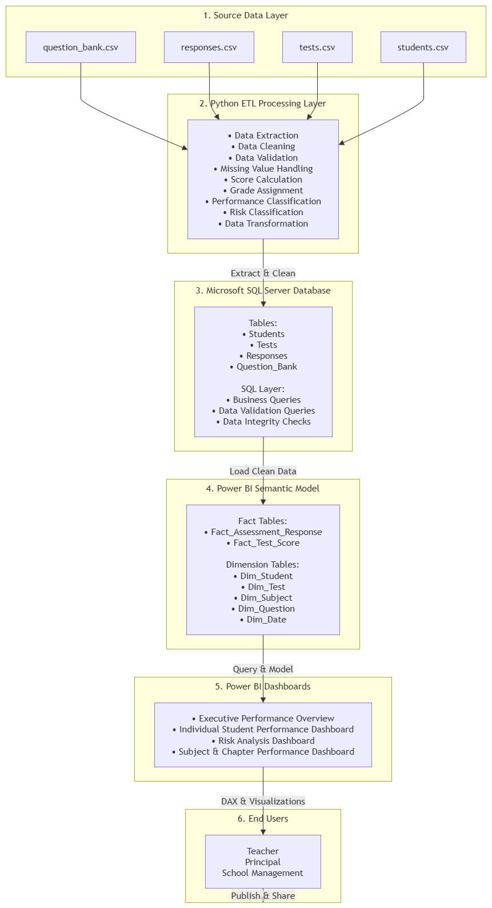
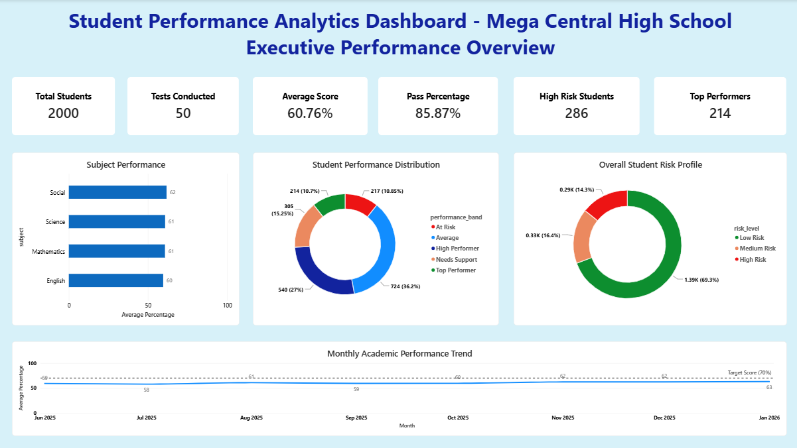
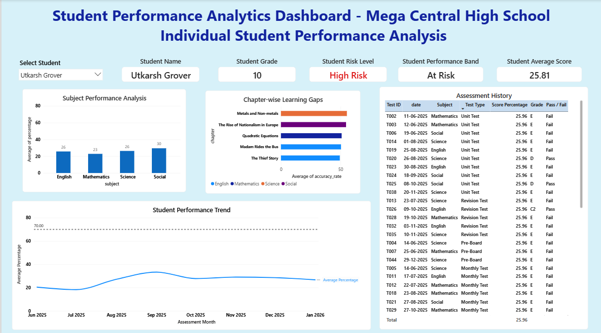
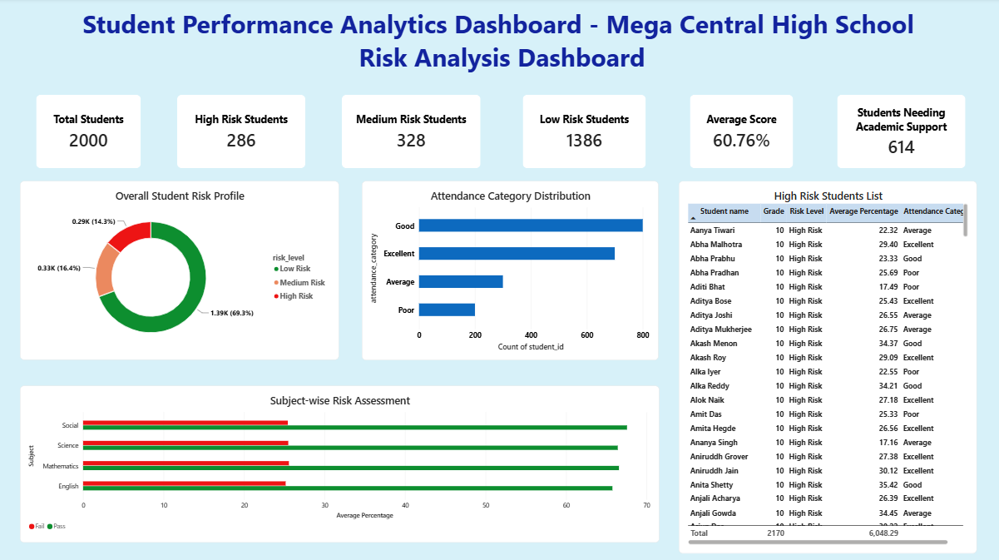
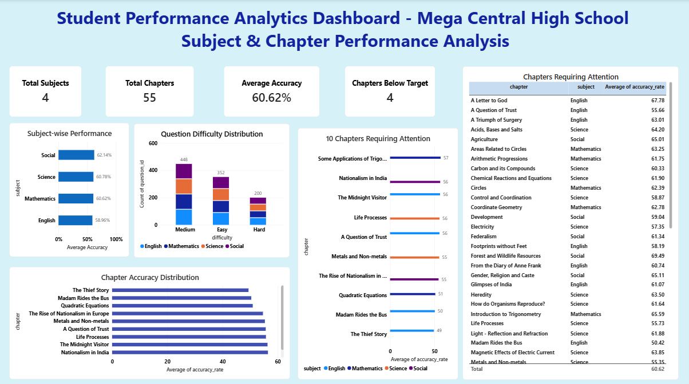

# 🎓 Student Performance Analytics & Decision Support System
### Business Analyst Portfolio Project


---

# 📌 Project Overview

The **Student Performance Analytics & Decision Support System** is an end-to-end Business Analysis portfolio project developed for **Mega Central High School**.

The project demonstrates the complete Business Analysis lifecycle—from requirement gathering and stakeholder analysis to solution design, SQL data validation, Python ETL, dashboard development, testing, and project closure.

The solution enables school management to monitor academic performance, identify at-risk students, detect weak learning areas, and make data-driven educational decisions through interactive Power BI dashboards.

---


## 🚀 Project Highlights

- End-to-End Business Analysis Project
- 40+ Business Analysis Deliverables
- 4 Interactive Power BI Dashboards
- SQL Database Design & Business Queries
- Python ETL Pipeline
- Complete Testing & UAT Documentation
- 12 Documentation Modules


## 📅 Project Timeline

| Phase | Duration |
|--------|----------|
| Requirement Analysis | Week 1 |
| Business Analysis | Week 2 |
| Solution Design | Week 3 |
| ETL & SQL Development | Week 4 |
| Dashboard Development | Week 5 |
| Testing & Project Closure | Week 6 |


# 🎯 Business Problem

Mega Central High School relied on multiple Excel spreadsheets for tracking student performance.

This resulted in:

- Manual report preparation
- Time-consuming performance analysis
- Difficulty identifying struggling students
- No centralized reporting system
- Delayed academic interventions
- Limited visibility into subject and chapter performance

The school required a centralized analytics solution that provides real-time academic insights for teachers, academic coordinators, and school management.

---

# 🎯 Project Objectives

The solution aims to:

- Monitor overall school academic performance
- Identify students requiring academic intervention
- Track individual student progress
- Analyze subject-wise performance
- Detect weak-performing chapters
- Support curriculum improvement
- Enable data-driven decision making
- Reduce manual reporting effort

---

# 👥 Stakeholders

- Principal
- School Management
- Academic Coordinator
- Subject Teachers
- Students (Indirect)
- Parents (Future Enhancement)

---

# 🛠 Technology Stack

| Technology | Purpose |
|------------|----------|
| Microsoft SQL Server | Database Management & Business Queries |
| SQL | Data Validation & Business Analysis |
| Python | ETL Pipeline |
| Pandas | Data Cleaning & Transformation |
| Power BI | Interactive Dashboards |
| Power Query | Data Transformation |
| DAX | KPI Calculations |
| Excel / CSV | Source Data |
| GitHub | Documentation & Version Control |

---

# 📂 Project Structure

```text
Student-Performance-Analytics/

│
├── 01_Project_Overview
├── 02_Stakeholder_Analysis
├── 03_Business_Analysis
├── 04_Requirements
├── 05_Data_Analysis
├── 06_Process_Modeling
├── 07_Solution_Design
├── 08_Data_Pipeline
├── 09_SQL
├── 10_Dashboard
├── 11_Testing
├── 12_Project_Closure
│
└── README.md
```

---

## 📊 Solution Architecture



---

# 📈 Dashboard Overview

The Power BI solution consists of **four interactive dashboards**.

---

## 1️⃣ Executive Performance Overview

Provides a school-wide summary of academic performance.



### KPIs

- Total Students
- Tests Conducted
- Average Score
- Pass Percentage
- High Risk Students
- Top Performers

### Insights

- Subject Performance
- Student Performance Distribution
- Student Risk Distribution
- Monthly Academic Performance Trend

---

## 2️⃣ Individual Student Performance Dashboard

Provides a detailed academic profile for each student.

## 2️⃣ Individual Student Performance Dashboard



### Features

- Student Selector
- Student Information Cards
- Subject-wise Performance
- Chapter-wise Learning Gaps
- Assessment History
- Student Performance Trend

---

## 3️⃣ Risk Analysis Dashboard

Helps identify academically vulnerable students.

## 3️⃣ Risk Analysis Dashboard



### KPIs

- Total Students
- High Risk Students
- Medium Risk Students
- Low Risk Students
- Average Score
- Students Needing Support

### Insights

- Student Risk Distribution
- Attendance Category Analysis
- Subject-wise Risk Assessment
- High Risk Student List

---

## 4️⃣ Subject & Chapter Analysis Dashboard

Evaluates curriculum effectiveness.

## 4️⃣ Subject & Chapter Analysis Dashboard



### KPIs

- Total Subjects
- Total Chapters
- Average Accuracy
- Chapters Below Target

### Insights

- Subject-wise Performance
- Question Difficulty Distribution
- Chapter Accuracy Distribution
- Lowest Performing Chapters
- Chapter Performance Table

---

# 🗂 Business Analysis Deliverables

This repository includes complete Business Analyst documentation.

## Project Overview

- Project Charter
- Business Case
- Problem Statement
- Scope Document

## Stakeholder Analysis

- Stakeholder Register
- Stakeholder Matrix
- RACI Matrix
- Communication Plan

## Business Analysis

- Current State Analysis
- Gap Analysis
- Root Cause Analysis
- Solution Proposal

## Requirements

- BRD
- FRD
- User Stories
- Acceptance Criteria
- Requirements Traceability Matrix

## Process Modeling

- As-Is Process
- To-Be Process
- BPMN Diagrams
- Data Flow Diagram

## Solution Design

- Solution Architecture
- Dashboard Wireframes
- Dashboard Requirements
- Dashboard User Guide

## Data Pipeline

- Python ETL
- Data Dictionary
- Source Data Mapping

## SQL

- Database Creation
- Business Queries
- Data Validation Queries

## Dashboard

- Power BI Report
- DAX Measures
- Dashboard Screenshots

## Testing

- Test Plan
- Test Cases
- Defect Log
- UAT Documentation

## Project Closure

- Lessons Learned
- Challenges & Solutions
- Future Enhancements
- Final Project Presentation

---

## 📈 Project Outcomes

✔ Automated manual reporting process

✔ Centralized student performance monitoring

✔ Enabled early identification of at-risk students

✔ Improved curriculum performance analysis

✔ Reduced reporting effort through interactive dashboards

✔ Supported data-driven academic decision-making

---

# 🧪 SQL Implementation

Microsoft SQL Server was used to strengthen the analytics solution.

SQL was used for:

- Creating the project database
- Importing cleaned datasets
- Data validation
- Business query development
- Data quality checks
- Supporting analytical reporting

Business queries include:

- Top performing students
- Subject performance analysis
- High-risk student identification
- Pass percentage calculation
- Weak chapter analysis
- Attendance analysis
- Performance trends

---

# ⚙ ETL Process

The Python ETL pipeline performs:

- Data Extraction
- Data Cleaning
- Duplicate Removal
- Missing Value Handling
- Data Transformation
- Score Calculation
- Performance Classification
- Risk Classification
- Export of Clean Analytical Dataset

---

# 📌 Key Business Rules

- Pass Percentage ≥ 35%
- Target Score = 70%
- Risk Levels:
  - Low Risk
  - Medium Risk
  - High Risk
- Performance Bands:
  - Top Performer
  - High Performer
  - Average
  - Needs Support
  - At Risk

---

# 🚀 Future Enhancements

- Parent Portal
- Teacher Performance Dashboard
- Attendance Analytics
- Predictive Student Risk Analysis
- AI-powered Learning Recommendations
- LMS Integration
- Real-time Data Refresh
- Mobile Dashboard
- School Benchmarking
- Natural Language Query Interface

---

# 📚 Repository Purpose

This project was developed as a complete Business Analyst portfolio project to demonstrate:

- Business Analysis
- Requirement Engineering
- Stakeholder Management
- SQL
- Data Validation
- ETL Pipeline Development
- Dashboard Design
- Data Visualization
- Testing
- Documentation
- End-to-End Project Delivery

---

# 👩‍💼 Author

**Ramyashree GV**

Business Analyst | Data Analytics Enthusiast

## 💼 Business Analyst Skills Demonstrated

- Stakeholder Analysis
- Requirement Gathering
- BRD & FRD Documentation
- User Story Writing
- Acceptance Criteria
- Requirement Traceability Matrix (RTM)
- Process Modeling (BPMN)
- Data Mapping
- KPI Definition
- Dashboard Requirement Analysis
- SQL Business Queries
- Data Validation
- Python ETL
- Power BI Dashboard Development
- User Acceptance Testing (UAT)

---

# 📄 Disclaimer

This project uses **synthetic educational data** created solely for portfolio and learning purposes. No real student information has been used.

## 🌟 About This Portfolio

This repository showcases an end-to-end Business Analysis project demonstrating the complete software development lifecycle, including business analysis, SQL, ETL, analytics, dashboard development, testing, and project documentation.

The project was developed to demonstrate practical Business Analyst skills for entry-level BA opportunities.

---

⭐ If you found this project interesting, feel free to explore the documentation and dashboards.